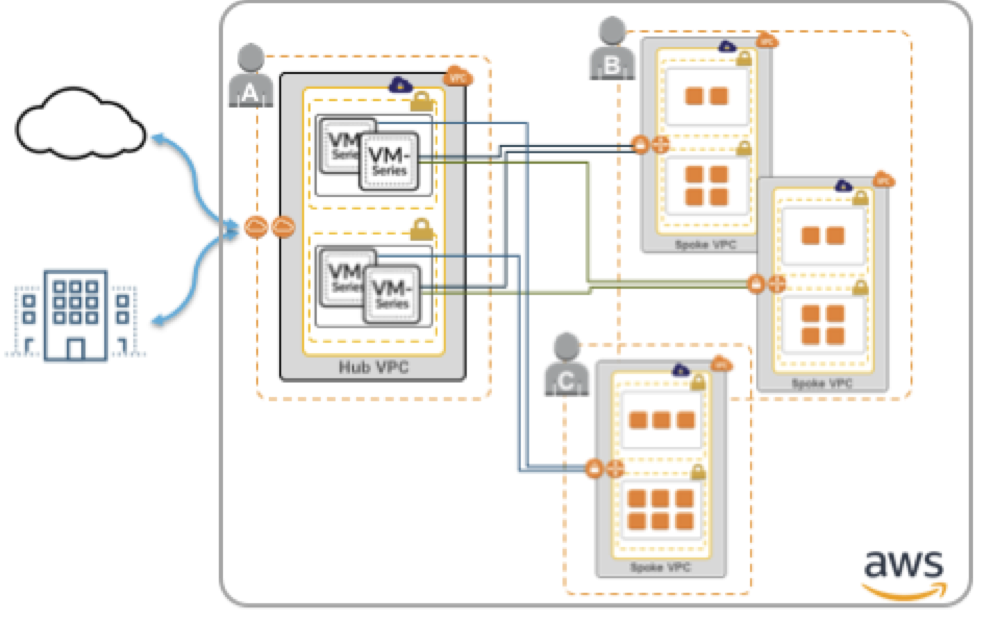

# AWS Transit VPC with VM-Series

This solution deploys a secured Transit VPC in AWS.  This allows you to secure many spoke or subscribing VPCs using centralized VM-Series firewalls in the transit/hub VPC.  The solution uses the VGW feature that lets the user specify the addressing such that 100s of spokes can be connected to a single hub with no address conflicts.  This solution will secure traffic between VPCs, between a VPC and an on-prem/hybrid cloud resource, and outbound traffic.  Securing outbound traffic in the Transit VPC allows you to allow safely enabled access to the Internet for tasks like software installs and patches without backhauling the traffic to an on prem-firewall for security.

For more detail about what takes place behind the scenes in this deployment please see the [Transit VPC with VM-Series Overview](https://github.com/PaloAltoNetworks/aws-transit-vpc/blob/master/documentation/solution_overview.md)

# Deployment guide
The deployment guide can be found [here](https://github.com/PaloAltoNetworks/aws-transit-vpc/blob/master/documentation/AWS_Transit_VPC_deployment_guide.pdf)

# Support Policy
The code and templates in the repo are released under an as-is, best effort, support policy. These scripts should be seen as community supported and Palo Alto Networks will contribute our expertise as and when possible. We do not provide technical support or help in using or troubleshooting the components of the project through our normal support options such as Palo Alto Networks support teams, or ASC (Authorized Support Centers) partners and backline support options. The underlying product used (the VM-Series firewall) by the scripts or templates are still supported, but the support is only for the product functionality and not for help in deploying or using the template or script itself. Unless explicitly tagged, all projects or work posted in our GitHub repository (at https://github.com/PaloAltoNetworks) or sites other than our official Downloads page on https://support.paloaltonetworks.com are provided under the best effort policy.

