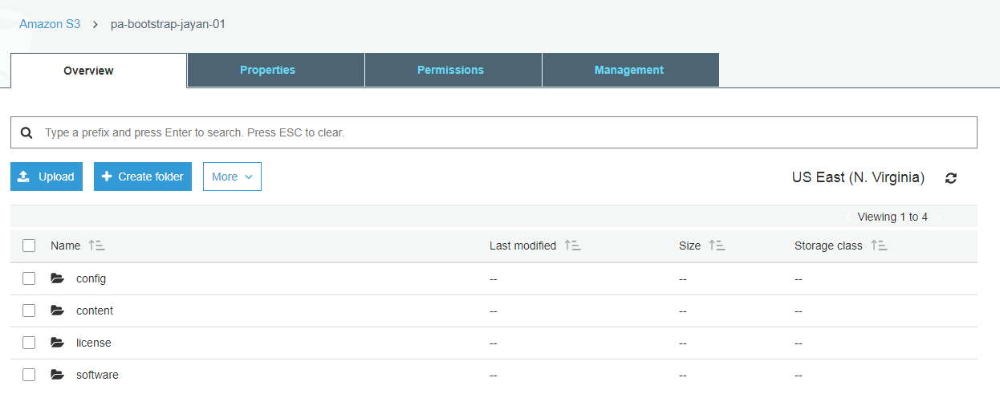
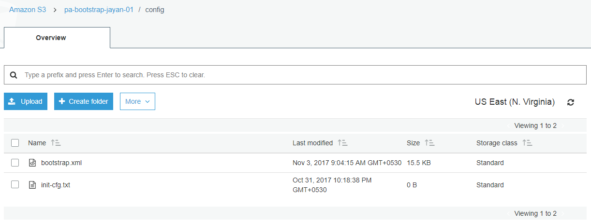
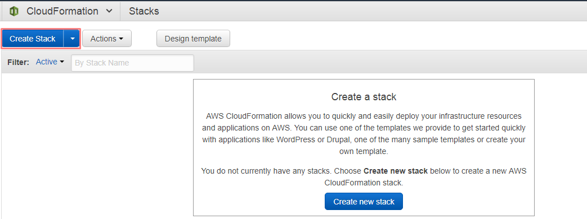
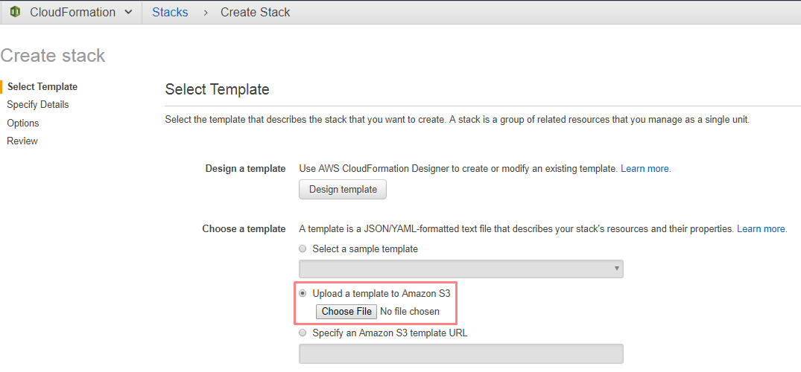
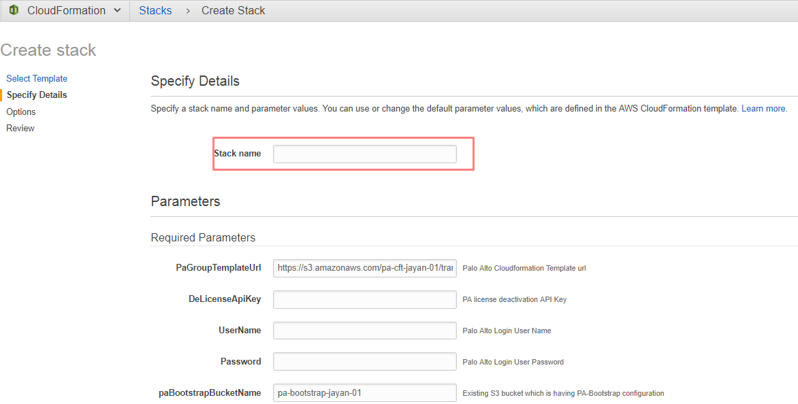
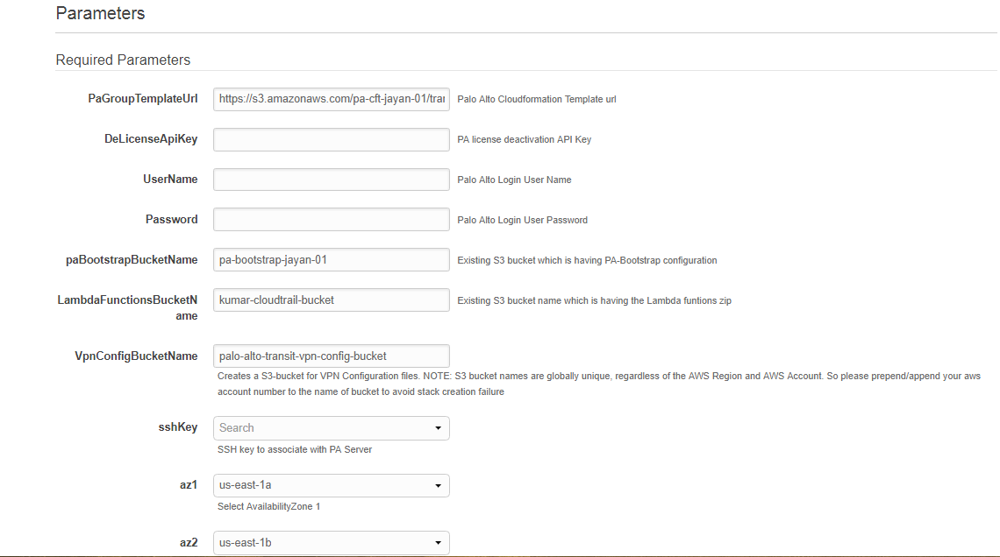
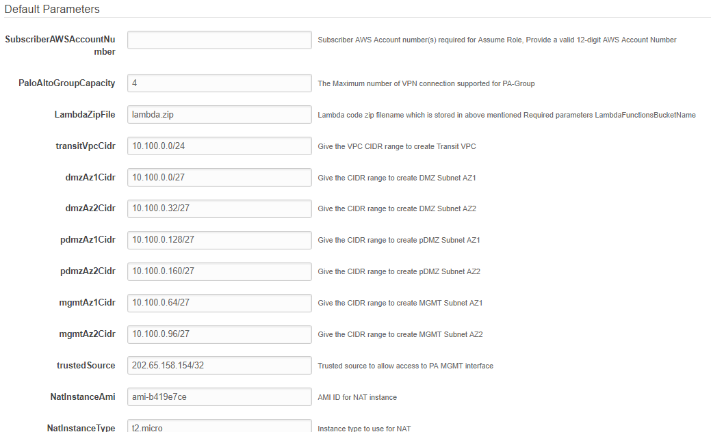
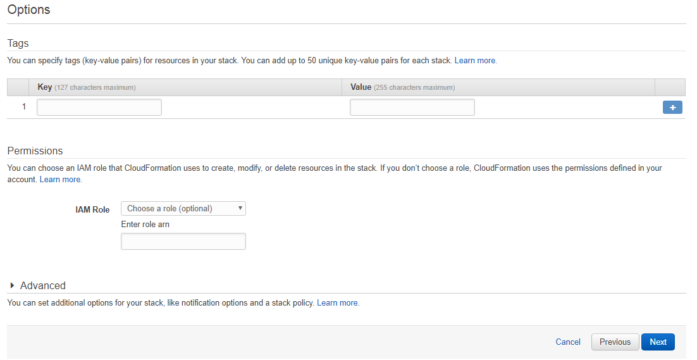
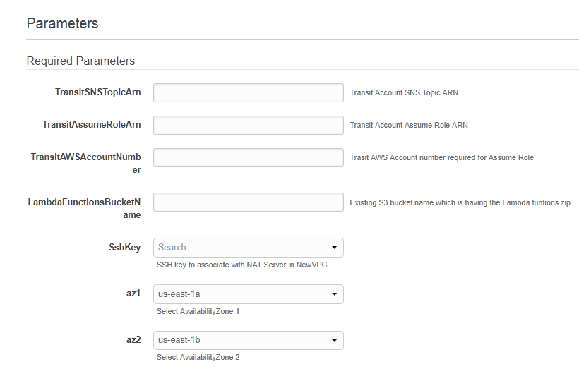
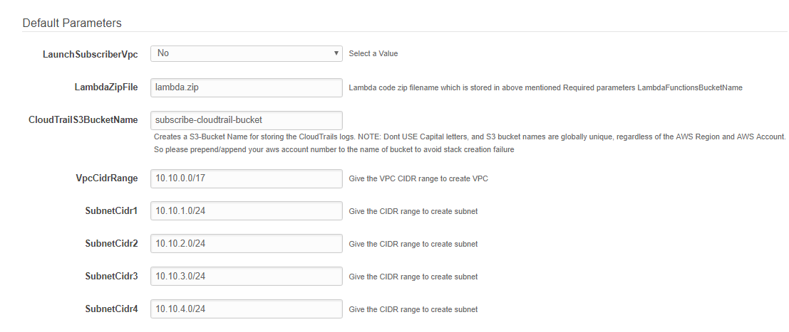

# Transit Environment Setup

The first step towards setting up the environment is to make sure the following S3 buckets are pre-created in Transit account.

## Create S3 buckets

Clone the "palo-alto-scripts" repository for required files to setup the Transit environment.

### S3 Bucket for PA Bootstrapping

S3 bucket is required to perform the Palo Alto bootstrapping function.
Find the "pa_bootstrap.zip" file in "prerequisites" directory of cloned repository, unzip it and upload them to the bootstrapping S3 bucket.

1. This bucket contains the following folders, which accounts for successful bootstrapping.

2. The config folder contains the “bootstrap.xml” file and the “init-cfg.txt” file:

3. The “license” file contains a file named “authcodes” with the authcode license  for the Palo Alto VM.
4. The “content” and “software” folders has empty dummy files created in them.

### S3 Bucket for Lambda Functions and CloudFormation Templates

An S3 bucket is required to store the "lambda.zip" file that helps create all the necessary Lambda functions. It will also have the CFT to create PAGroups and 'availableVPNCidr.txt' file that contains available CIDR ranges for creating VPN.

Find the "availableVPNCidr.txt" and "paGroupCFT.json" files under "cfts" directory. Add the contents of "lambda" directory to "lambda.zip" then upload the files to S3 bucket. 'Lambda.zip' file is available in 'prerequisites' directory.

## Create a Transit Account Stack

This stack creates the Transit account skeleton.

For the Transit account CFT, clone the “palo-alto-scripts” repo from AWS CodeCommit. Under the “cfts”, use the “initializeTransitAccount.json” CFT to launch the Transit account stack.

Steps to launch the “initializeTransitAccount” stack

1. Navigate to AWS CloudFormation on the Transit AWS account.

2. Click on Create Stack

3. Next, under "Choose a template", click on the “Upload a template to Amazon S3” radio button, and browse for the CFT from your local computer.

4. Next, enter a unique name for your stack.

5. The Parameters have been categorized as “Required” and “Default”. As the name suggests, the "Required Parameters" are mandatory and the "Default Parameters" have default values that can be modified if required.

6. Below screenshot indicates the Required Parameters:

  a. For the parameter “PaGroupTemplateUrl”, indicate the Palo Alto CloudFormation template URL in the dialog box. This URL should indicate the path to the CFT, which in this case has been stored in an S3 bucket.

  b. In the “DeLicenseAPIKey” parameter dialog box, enter the PA license deactivation API Key.

  c. For the “UserName” parameter, enter a Palo Alto login username (admin) in the dialog box.

  d. Next, for the “Password” parameter, enter a password the login user.

  e. For the parameter “paBootstrapBucketName”, enter the name of the existing S3 bucket that has been created for PA bootstrap functionality.

  f. In the “LambdaFunctionsBucketName”, enter the name of the existing S3 bucket that contains the Lambda functions zip.

  g. For the parameter “VpnConfigBucketName”, enter a unique name that will be used to create an S3 bucket which will be used to store the VPN configuration files.

  h. Next, for the “sshKey” parameter, select the SSH Key from the dropdown, to be used to launch the PA servers.

  i. For the parameters “az1” and “az2”, select the two availability zones from the dropdowns, to be used to create the Transit VPC subnets and in turn launch the PA servers into.

7. Below screenshot indicates the parameters with default values.

  a. The parameter “SubscriberAWSAccountNumber” is required for assume role. Enter a valid 12-digit AWS account number.

  b. Next is the “PaloAltoGroupCpacity” parameter, that requires specifying the maximum number of VPN connections supported by a PAGroup.

  c. For the “LambdaZipFile” parameter, enter the name of Lambda code zip file name which is stored in the LambdaFunctionsBucketName, whose name is indicated in the required parameters.

  d. In the “transitVpcCidr” parameter dialog box, enter a VPC CIDR to be used to create the Transit VPC.

  e. For the subnet parameters “dmzAz1Cidr”, “dmzAz2Cidr”, “pdmzAz1Cidr”, “pdmzAz2Cidr”, “mgmtAz1Cidr” and “mgmtAz2Cidr”, specify the CIDRs to be used to create the subnets.

  f. For the “trustedSource” parameter, enter a Trusted IP address to allow access to the NAT instance.

  g. For the “NatInstanceAmi” parameter, enter the AMI ID to be used to launch the NAT instance. This NAT instance will be used to connect to the PA Mgmt interface.

  h. In the “NatInstanceType” parameter dialog box, specify the instance type to use for the NAT instance.

8. Then click on “Next”.

9. Optionally, enter tags for your stack and then click on “Next”.

10. Review the details of the stack and then on the same page, under "Capabilities", check the “I acknowledge that AWS CloudFormation might create IAM resources with custom names” option.

11. Then click on “Create”. The stack takes about 10min to complete launching.

Once the Transit setup is done, capture the stack outputs which will be used in further steps while setting up the Subscriber environment.

# Subscriber Environment Setup

The first step towards setting up the environment is to make sure the following S3 bucket are pre-created in the Subscriber account:

## Create S3 bucket.

Clone the "palo-alto-scripts" repository for required files to setup the Subscriber environment.

### S3 bucket to store the Lambda functions zip and Subscriber VPC CloudFormation template:

An S3 bucket is required to store the "lambda.zip" file that helps create all the necessary Lambda functions. It will also have the CFT to create Subscriber VPC.

Find the "subscriberVpcCFT.json" file under "cfts" directory, add the contents of "lambda" directory to lambda.zip and upload these files into S3 bucket. 'Lambda.zip' file is available in 'prerequisites' directory.

## Create a Subscriber Account Stack:

This stack creates the Subscriber account skeleton.

For the Subscriber account CFT, clone the “palo-alto-scripts” repo from AWS Code Commit. Under the “cfts”, use the “initializeSubscriberAccount.json” CFT to launch the Subscriber account stack.

Steps to launch the “initializeSubscriberAccount” stack

1. Navigate to AWS CloudFormation on the Subscriber AWS account.

2. Click on Create Stack.

3. Next, under "Choose a template", click on the “Upload a template to Amazon S3” radio button, and browse for the CFT from your local computer.

4. Next, enter a unique name for your stack.

5. The Parameters have been categorized as “Required” and “Default”. As the name suggests, the Required Parameters are mandatory and the Default Parameters have default values that can be modified if required.

6. Below screenshot indicates the Required Parameters

  a. Get the "TransitSNSTopicArn" from the captured Transit setup stack outputs and provide.

  b. Get the "TransitAssumeRoleArn" from the captured Transit setup stack outputs and provide.

  c. Provide the "TransitAWSAccountNumber".

  d. Provide "LambdaFunctionsBucketName" which is having lamda.zip file in Subscriber account.

  e. Next, for the “sshKey” parameter, select the SSH Key from the dropdown, to be used to launch the PA servers.

  f. For the parameters “az1” and “az2”, select the two availability zones from the dropdowns, to be used to create the Transit VPC subnets and in turn launch the PA servers into.

7. Below screenshot indicates the parameters with default values.

    a. Set a value for "LaunchSubscriberVpc" parameter, if it is set "Yes", subscriber VPC will get launched along with the subscriber environment setup. If not, the subscriber CFT need to be launched manually.

    b. For the “LambdaZipFile” parameter, enter the name of Lambda code zip file name which is stored in the LambdaFunctionsBucketName, whose name is indicated in the required parameters.

    c. Provide "CloudTrailS3BucketName". Creates a S3-Bucket Name for storing the CloudTrails logs. NOTE: Dont USE Capital letters, and S3 bucket names are globally unique, regardless of the AWS Region and AWS Account. So please prepend/append your aws account number to the name of bucket to avoid stack creation failure.

    d. If "LaunchSubscriberVpc" parameter is set to Yes then below parameters will be used to create a new subscriber VPC
      * "VpcCidrRange"
      * "SubnetCidr1"
      * "SubnetCidr2"
      * "SubnetCidr3"
      * "SubnetCidr4"
    These parameters have default values that can be modified if required.

8. Then click on “Next”.

9. Optionally, enter tags for your stack and then click on “Next”.
    

10. Review the details of the stack and then on the same page, under "Capabilities", check the “I acknowledge that AWS CloudFormation might create IAM resources with custom names” option.

11. Then click on “Create”.

# Launch Subscriber VPC

Upon successfully setting up the Transit and Subscriber environment then create a Subscriber VPC to setup the VPN connection.
Any number of subscriber VPCs can be launched but, make sure that provided VPC and Subnet CIDRs are not conflicting with other Subscriber VPC stacks.

## Create a Subscriber VPC Stack:

This stack creates the subscriber VPC.

For the Transit account CFT, clone the “palo-alto-scripts” repo from AWS Code Commit. Under the “cfts”, use the "subscriberVpcCFT.json” CFT to launch the Subscriber VPC stack.

Steps to launch the "subscriberVpcCFT" stack:

1. Navigate to AWS CloudFormation on the Subscriber AWS account.

2. Click on Create Stack

3. Next, under Choose a template, click on the “Upload a template to Amazon S3” radio button, and browse for the CFT from your local computer.

4. Next, enter a unique name for your stack.

5. Provide the parameters to the stack. Make sure that VPC and Subnet ranges are in valid.

6. Then click on “Next”.

7. Optionally, enter tags for your stack and then click on “Next”.

8. Review the details of the stack and then on the same page, under "Capabilities", check the “I acknowledge that AWS CloudFormation might create IAM resources with custom names” option.

9. Then click on “Create”.

