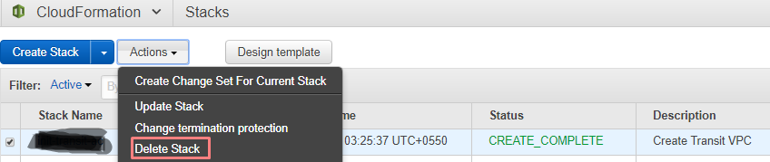

# Rebuild Transit and Subscriber Environments

This document helps in rebuilding the Transit and Subscriber environments.
The rebuilding of setup involves destroying of existing environments and setting it up from scratch.
Follow the below process to rebuild the environment quickly.

## Destroy Subscriber Environment

Login to the Subscriber account and follow the below steps to delete the Transit environment.

### Destroy Subscriber VPC Stacks

Find the Subscriber VPC CloudFormation stacks deployed in the Subscriber account

  * Select "Delete Stack" from "Actions" as shown in the below screenshot to delete the VPC stacks.
  
  * Delete the VGW, CGW and VPN connections related the VPC that you deleted from AWS VPC Console.

### Destroy Subscriber Environment Setup Stack

Destroy the Subscriber environment setup stack from Subscriber account as shown in the below screenshot.
  * Select "Delete Stack" from "Actions" as shown in the below screenshot to delete the stacks.
  

## Destroy Transit Environment
Login to the Transit account and follow the below steps to delete the Transit environment.

### Destroy PAGroup Stack

Find the Transit environment related PAGtoup stacks and delete them as shown in the below screenshot
  * Select "Delete Stack" from "Actions" as shown in the below screenshot to delete the PAGroup stacks.
  

### Destroy Transit Environment Setup Stack

Destroy the Transit environment setup stack from Transit account as shown in the below screenshot.
  * Select "Delete Stack" from "Actions" as shown in the below screenshot to delete the stacks.
  

Make sure all the resources related to that Subscriber and Transit environment are deleted successfully.

## Build Transit and Subscriber Environments

Execute the steps provided in the deployment doc to build the Transit and Subscriber environments
